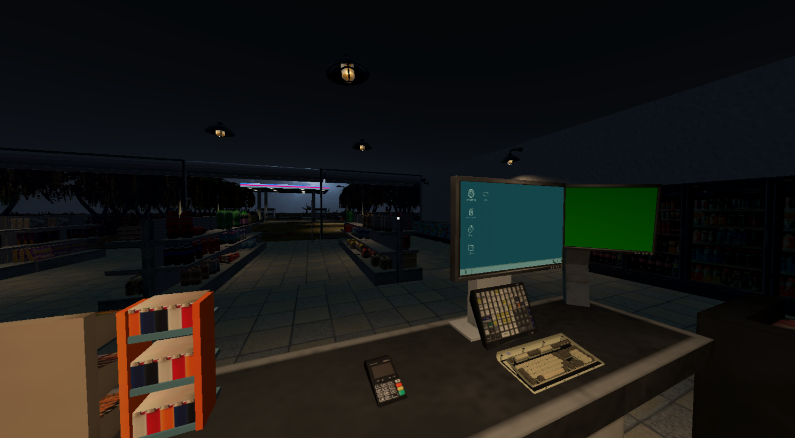
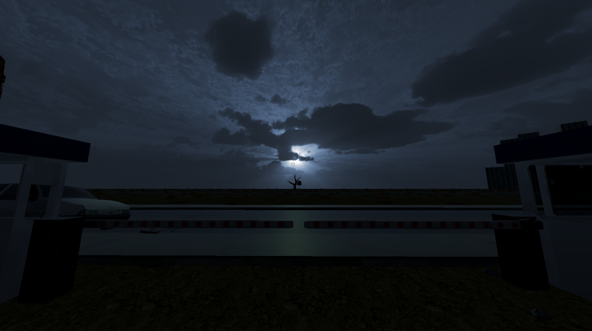
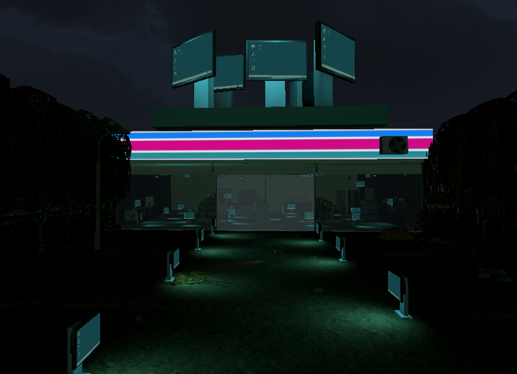

# About My Pretty Neighbor

**1 Till Midnight** was created for UM Game Jam 2024, developed in under 48 hours. You play as a local 11 Eleven convenience store worker trapped in a nightmare filled with your character’s fears. The theme was 4th wall break, so the game scares the player by revealing their real computer information in-game.
This concept ultimately won us First Place!

## Screenshots
{70}
{70}
{70}

## My Role
As the **Lead Gameplay Programmer**, I was responsible for:

* **Puzzles and 4th Wall information system**: 
* **Interaction and logic**: Created custom dither shaders to enhance the horror atmosphere
* **Enemy AI**: Led the technical vision and ensured all systems worked cohesively

## Technical Stack

 **Engine**: Unity
 **Programming**: C#
 **Development Time**: 2 days

---

