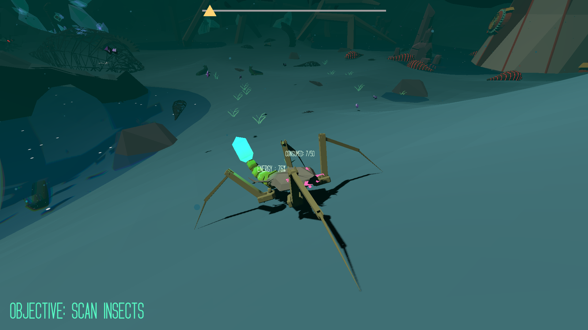
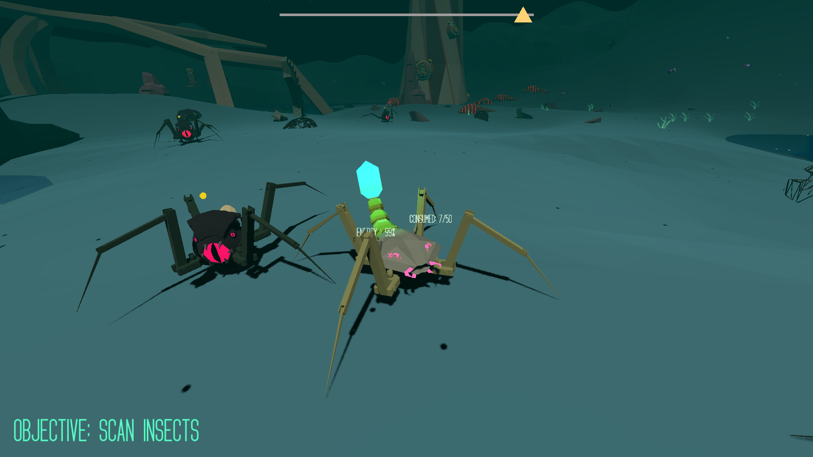
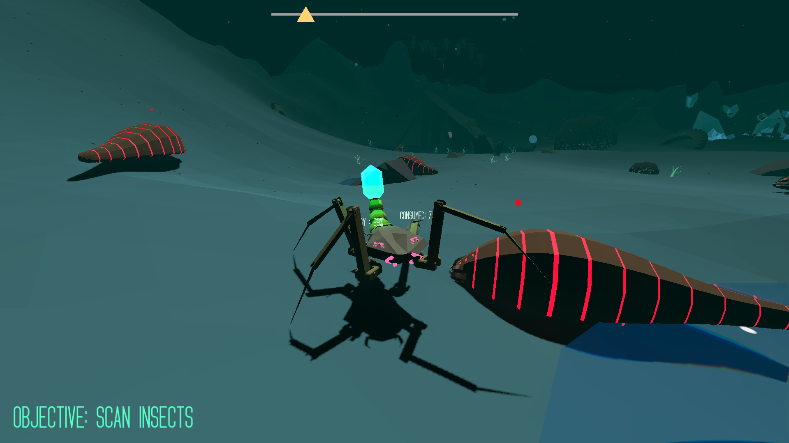

# About Assimilation
Assimilation was the enttry to indie game jam 2025, which won us the first place, You're an insect operative, deployed to the strange and stylish planet Vampa. Your mission: analyze and consume 4 unique native bugs to adapt, survive, and conquer through assimilation.

## What I Built
I was the team leader and sole programmer for this game jam, developing the procedural animation system and all core gameplay features. My technical direction and implementation played a major role in leading our team to win the competition.
---

## Showcase

{70}
{70}
{70}
---

## Win (Bonus :P)
Team: 1Brain4Brush

{40}

---