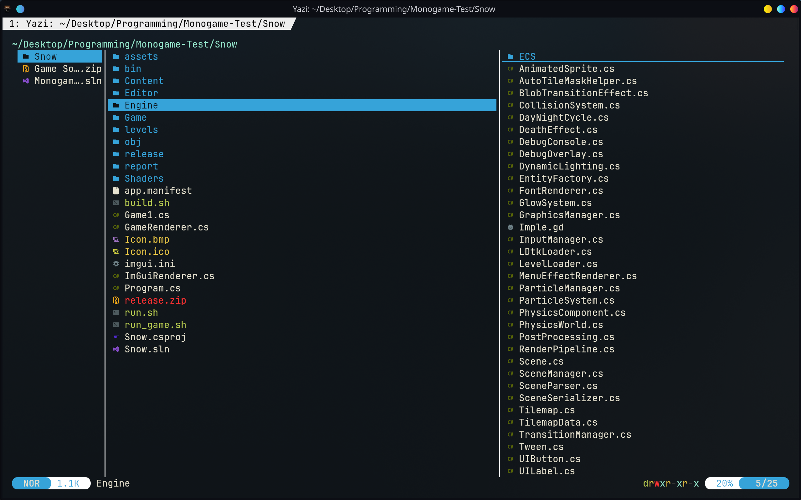
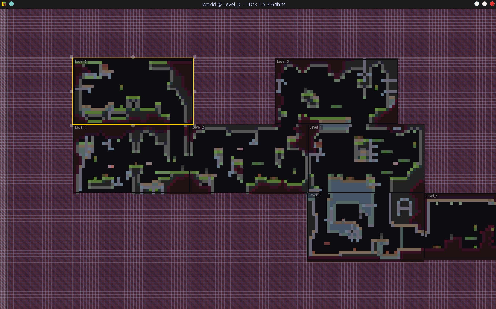
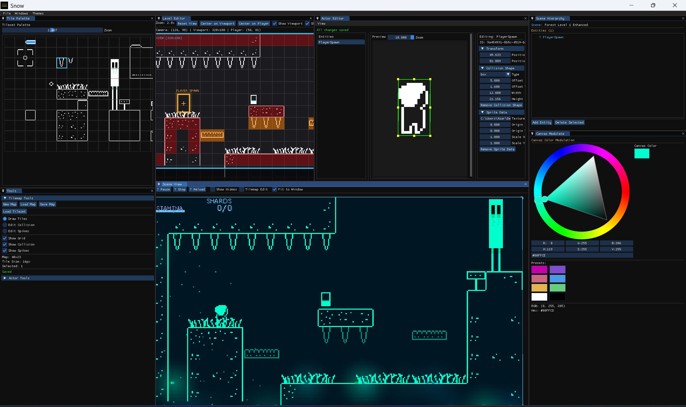
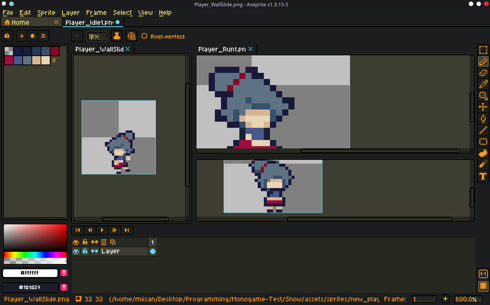
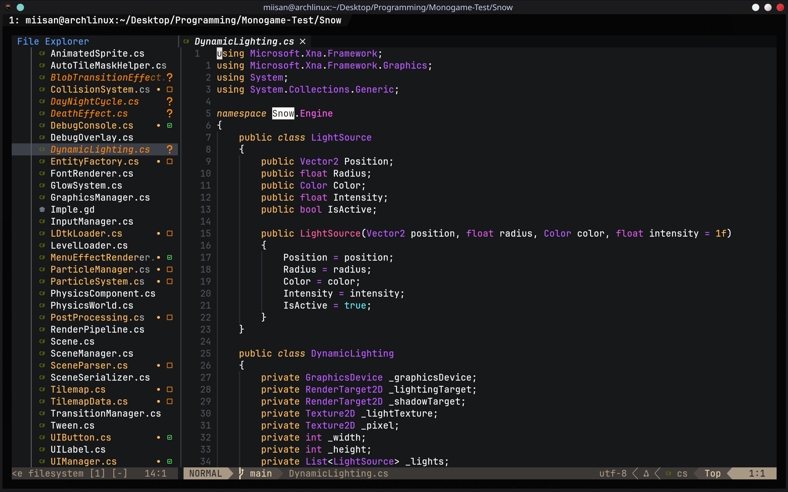
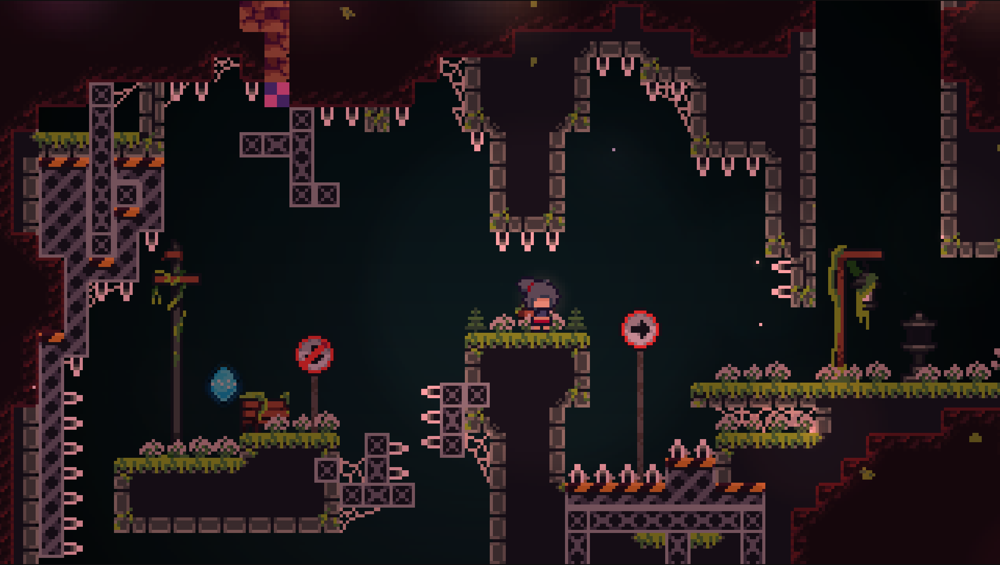
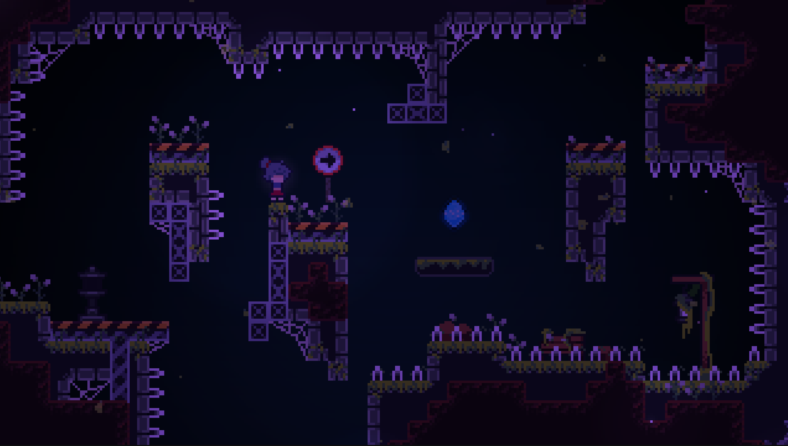
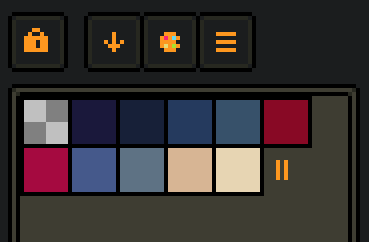

# About HomeSick

**HomeSick** is a **2D precision platformer** built entirely by me — including a custom game engine, physics, collision, animation, art, and level design.  
Developed fully from scratch in **C# + MonoGame**, this project is both a technical showcase and a personal story about returning to a place you once abandoned. :contentReference[oaicite:0]{index=0}

## Game Walkthrough

[youtube](https://www.youtube.com/watch?v=ihxsGrse3_8)

---

## Building a Game From Scratch

HomeSick wasn’t built in Unity or Godot — I developed my own engine on top of MonoGame, giving me complete control over physics, movement feel, rendering, particles, and camera systems.

Here’s an overview of the core engine architecture I designed:

{65}

The goal was simple:  
**make a platformer that feels expressive, smooth, and precise — entirely powered by my own systems.**

---

## Level Creation & World Building

To build the world of Merp, I integrated **LDtk** into my engine pipeline.  
It allowed me to design multi-layered levels with parallax, collision tiles, entities, and atmosphere.

{65}

The abandoned town aesthetic — moss, cracked walls, overgrown streets — was crafted through hand-drawn tilesets and layered backgrounds.

---

## Custom Tools & Editor Integration

While MonoGame doesn’t come with an editor, I used LDtk and custom debug displays to visualize collision, hitboxes, and gameplay flow.

Below is an example of the editor views used during development:

{60}

Each layer (background, midground, collisions, details) was tuned for readability, platforming clarity, and environmental storytelling.

---

## My Role

I developed every part of HomeSick:

### ** Custom Engine & Systems**
* Physics simulation  
* Full AABB swept collision  
* Animation state machine  
* Particle FX system  
* Dash ghost trails  
* Smooth camera + screen shake  
* Scene & entity management  
* Input buffering + coyote time  

### ** Art & Animation**
* Character sprite sheets  
* Tilesets, props, foliage  
* Atmospheric backgrounds  
* All pixel art animations  
* VFX sprites & ghost trails  

{50}

### ** Level Design**
* Complete level layout  
* Hazard placement  
* Collectibles & secrets  
* Flow pacing & difficulty  

---

## Gameplay & Screenshots

HomeSick focuses on movement that feels responsive and rewarding.  
Every mechanic — dash, wall-jump, climb, momentum control — was tuned manually through hours of iteration.

Here’s a look at how the game plays:

{65}

The abandoned world slowly reveals pieces of Alya's past through the environment rather than dialogue.

{65}

Challenging platforming sections push the player to master chaining movement abilities.

{65}

---

## Art Direction

The style is inspired by melancholic, abandoned spaces — muted colors, overgrown structures, and quiet atmosphere.

To support this mood, I designed a custom player palette:

{45}

Alya’s bright palette ensures she always stands out against the environment.

---

## Technical Stack

**Engine:** Custom-built  
**Framework:** MonoGame 3.8  
**Language:** C#  
**Tools:** LDtk, Aseprite  
**Team Size:** Solo  
**Development Time:** Several months  

---

## Current Status

HomeSick is being expanded into a **full Steam release** featuring:

* New biomes & levels  
* Additional movement abilities  
* Soundtrack & ambience  
* Accessibility options  
* Controller support  
* Speedrun timer + leaderboard  
* Achievements, cloud saves  

---

## A Personal Note

This project represents complete end-to-end solo development.  
From blank editor → engine architecture → art → animations → level design → polish.

Every pixel and every line of code is mine.

HomeSick is not just a technical display —  
it’s a story about coming home after running away…  
and finding that the place changed just as much as you did.

