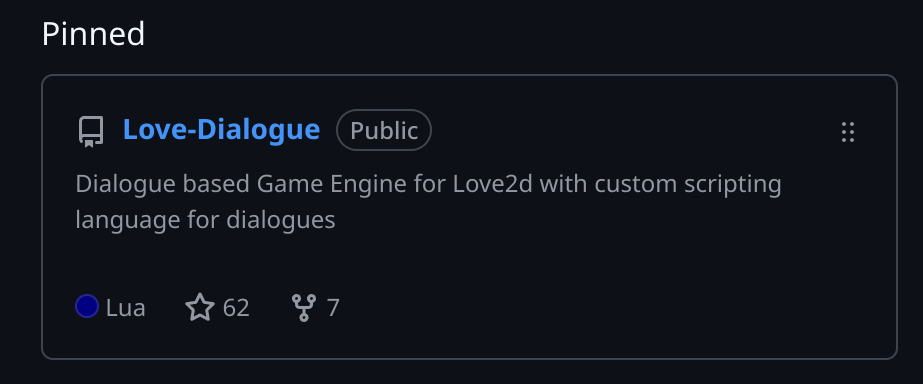

# About LoveDialogue

{50}

**LoveDialogue** is a **lightweight dialogue engine** built for **LÖVE (Love2D)**.
I originally started this project because I got into visual-novel games and explored engines like **Ren’Py** — but it felt too goofy, limited, and not the style I wanted. So instead, I decided to build my **own custom dialogue system from scratch**, designed to be flexible, clean, and fully under my control.

It adds rich, expressive visual-novel style dialogue to any 2D game — with text effects, portraits, branching choices, and full customization.
---

{50}

As of **November 2025**:
**62+ GitHub Stars**
**7 Forks**

---

## Core Features

* **Rich Text Rendering**
  Supports `{wave}`, `{shake}`, `{color}`, `{bold}`, `{italic}` and more.

* **Character Portrait System**
  Portraits, expressions, sprite sheets, name colors.

* **Branching Dialogue**
  Choices, scene labels, flow control.

* **Theming & UI Customization**
  9-patch boxes, fonts, padding, animations, fade-in/out.

* **Multilingual Support**
  Latin + **CJK** text rendering with custom spacing.

* **Plugin Support**

---

## Showcase

{70}

---

## Basic Usage

Just drop the folder into your project and load:

```lua
local LoveDialogue = require "LoveDialogue"

function love.load()
    dlg = LoveDialogue.play("dialogue.ld")
end

function love.update(dt)
    dlg:update(dt)
end

function love.draw()
    dlg:draw()
end
```

Dialogue files use a clean readable syntax:

```
Character: Hello there.
Character(Happy): This supports expressions!

-> Ask more [target:askMore]
-> Leave [target:end]
```

---

## What I Built

I developed the entire system:
**Custom text parser & effect engine**
**Portrait & expression system**
**Choice + label interpreter**
**9-patch UI renderer**
**Auto-layout & responsive scaling**
**Theme loader**
**Full CJK rendering support**

---

## Current Status

LoveDialogue is fully open-source and actively maintained.
More features (like lip-sync, timelines, and in-editor previewing) are planned for future updates.

---