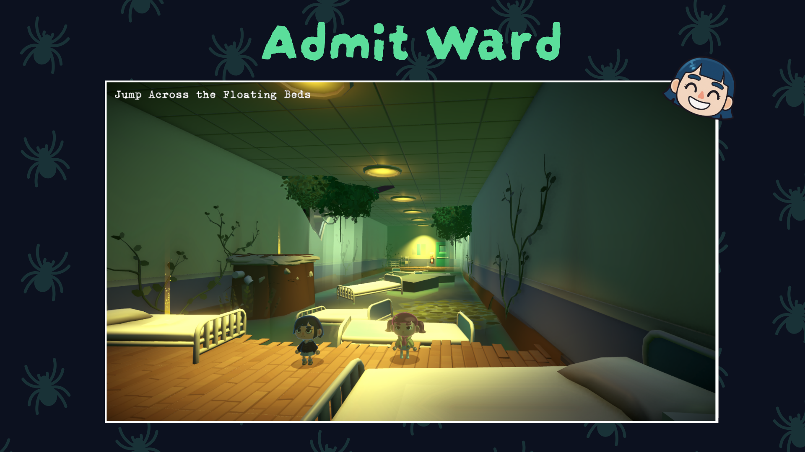
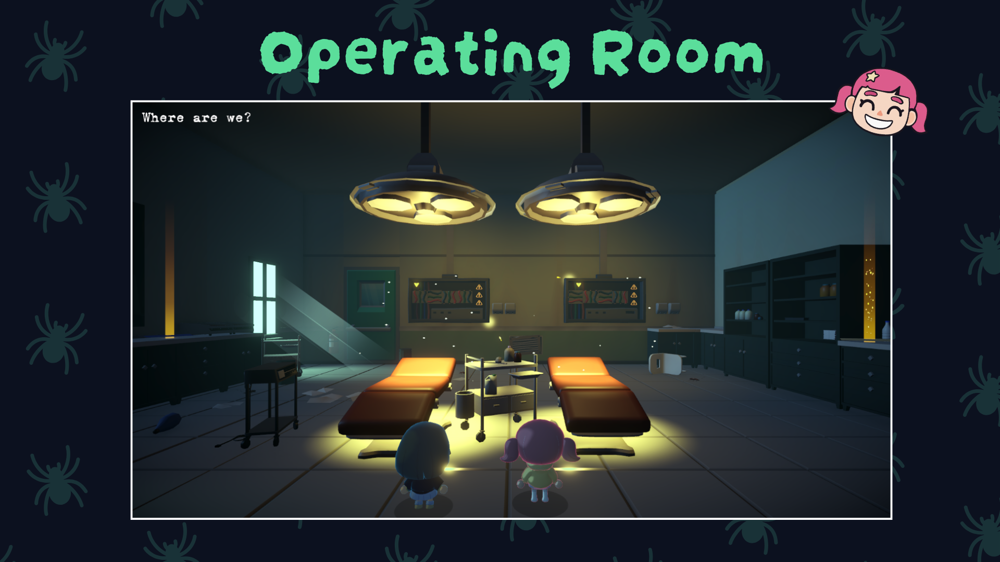
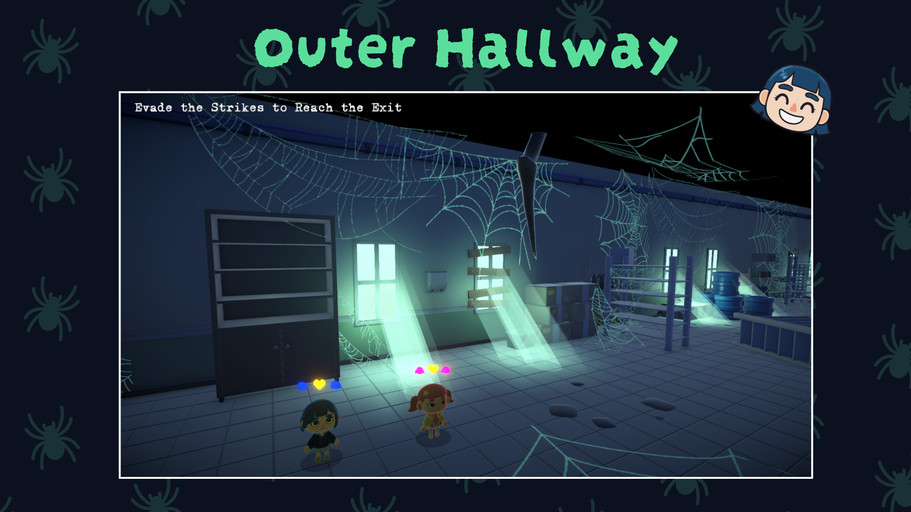
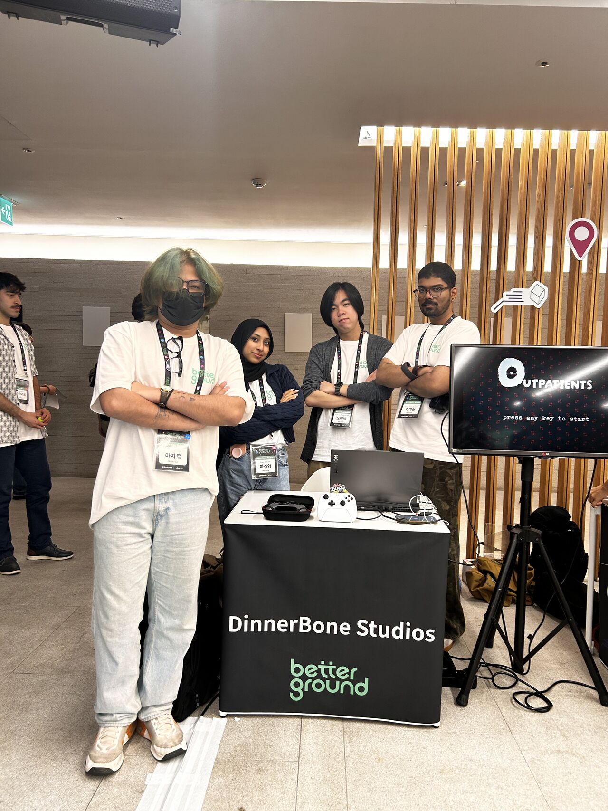

# About Outpatients

**Outpatients** was created for the **BetterGrounds 2025** competition, where it won **First Place** and earned our team the opportunity to be flown out to **South Korea** to represent our work!

This is a **third-person co-op horror game** where you play as two young girls trying to escape an abandoned, deranged hospital. The game emphasizes teamwork, atmospheric tension, and stylized visuals that push the boundaries of what can be achieved in a week-long game jam.

## Game Trailer

[youtube](https://www.youtube.com/watch?v=-YtFEPVKYj8)

## Gameplay

{80}

## My Role

As the **Team Leader and Sole Programmer**, I was responsible for:

* **Complete Game Systems Programming**: Implemented all gameplay mechanics, player controls, co-op systems, and game logic in just 7 days
* **Custom Shader Development**: Wrote custom shaders in HLSL to achieve the game's highly stylized visual aesthetic
* **Character Rendering**: Developed specialized shaders for character rendering to create the unique art style
* **Lighting Systems**: Created custom lighting shaders to enhance the horror atmosphere
* **VFX Programming**: Implemented visual effects and particle systems using custom shaders
* **Technical Direction**: Led the technical vision and ensured all systems worked cohesively

The biggest technical challenge was achieving the distinctive stylized visuals while maintaining performance. I wrote custom shaders from scratch to handle cel-shading, outline rendering, and atmospheric lighting that gave the game its unique horror aesthetic.

## Screenshots

{70}

{70}

{70}

{70}

## The South Korea Experience

After winning first place, our team was flown to South Korea to showcase **Outpatients** at the BetterGrounds showcase event, organized by **Krafton** - the creators of **PUBG**.

This was an incredible opportunity to meet the Krafton team, present our work internationally, and connect with industry professionals and other talented developers. Being recognized by such a major game studio was both humbling and inspiring.

{70}

The experience taught us invaluable lessons about game development under pressure, the importance of technical artistry, and how polish and presentation can elevate a game jam project to something truly special.

## Development Insights

Creating this game in 7 days was intense but incredibly rewarding. Some key takeaways:

* **Custom shaders** make a huge difference in achieving a unique visual identity
* **Technical artistry** is just as important as pure programming - understanding how visuals work at a low level opens up creative possibilities
* **Clear technical leadership** helps a team stay focused and efficient during crunch time
* **Co-op mechanics** require careful systems design to feel responsive and fun

## Technical Stack

* **Engine**: Unity
* **Programming**: C#
* **Shaders**: HLSL (Custom written)
* **Development Time**: 7 days

## Current Status

The game is currently in active development for a full playable release. We're expanding on the original jam version with more content, refined mechanics, and enhanced visuals.

For more details about our journey, check out [this LinkedIn post](https://www.linkedin.com/posts/azar-ali-8b6364280_just-wrapped-up-our-betterground-trip-to-activity-7379498844822278144-hTdo) about the BetterGrounds trip!

---

*This project represents what can be achieved when technical expertise meets creative vision under tight constraints. It's a testament to the power of custom shader programming and systems-level thinking in game development.*
