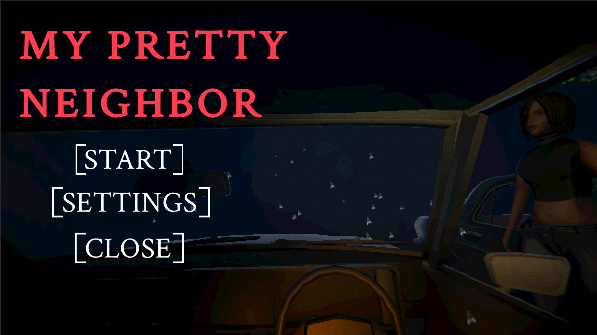
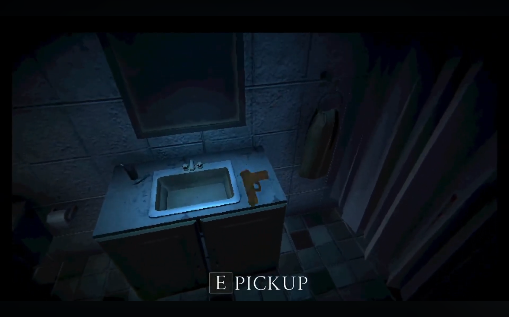
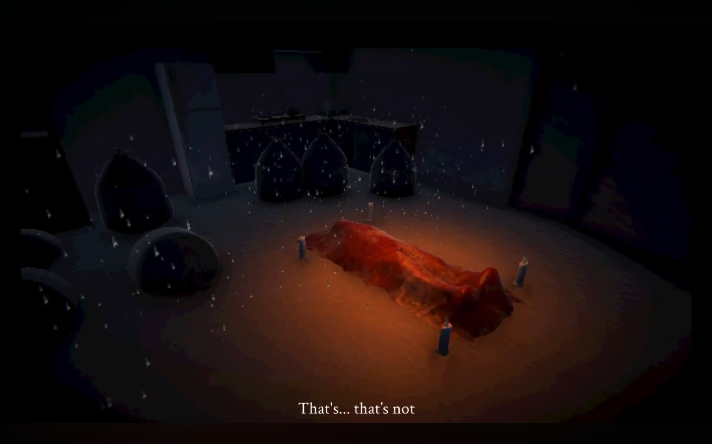
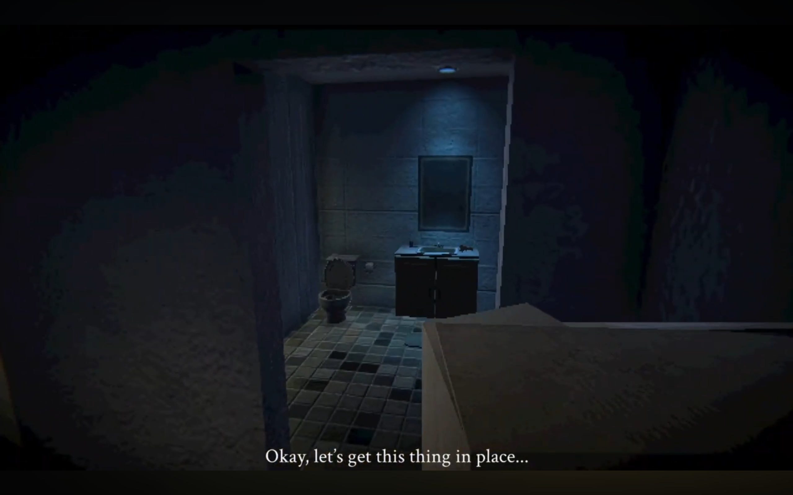

# About My Pretty Neighbor

**My Pretty Neighbor** was created for our university assignment. It is a retro PSX-inspired horror game where you play as a young man returning to his parents’ house after their passing. Upon coming back, the condominium feels strangely eerie and unsettling. The game takes inspiration from classics like Silent Hill and Resident Evil 4, featuring strong survival-horror elements.

## Gameplay Showcase

[youtube](https://youtu.be/6JxyXcENUQo?si=6-HDOOGbiWfShsP2)

## My Role

As the **Team Leader and Sole Programmer**, I was responsible for:

* **Complete Game Systems Programming**: 
* **Lighting Systems**: Created custom dither shaders to enhance the horror atmosphere
* **Technical Direction**: Led the technical vision and ensured all systems worked cohesively

## Screenshots
{70}
Location in this game was inspired by an actual condonium where one of my team members lived so it had that personal scary vibe lol since we modelled it.
{70}
{70}
{70}
{70}

## Technical Stack

 **Engine**: Unity
 **Programming**: C#
 **Shaders**: HLSL (Custom written)
 **Development Time**: 7 days

## Current Status
This game was created for a university assignment. While it looks and plays well, we didn’t have enough time to fully polish it for playable fun release, so it’s currently on hiatus until we can return to refine it further.
---

